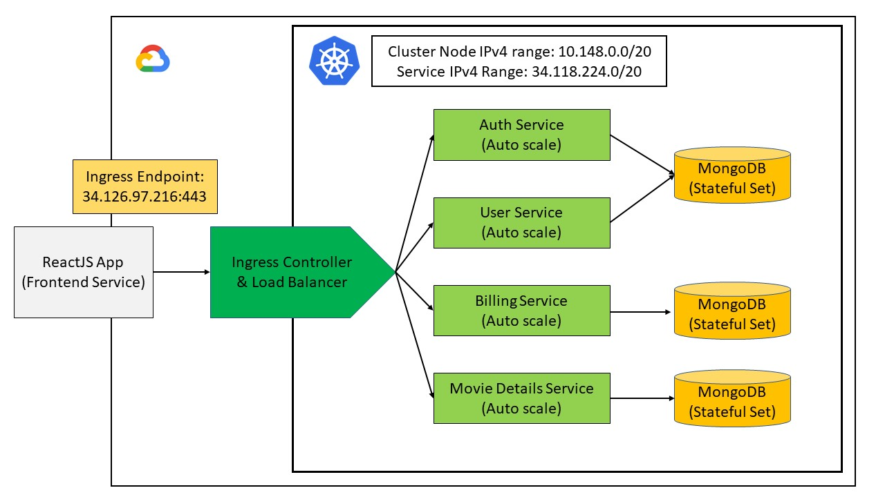

# Đồ Án Môn NT132 - Movie App
## Lời mở đầu
Nhóm chúng em xin phép chào thầy, các bạn cũng như mọi người truy cập được tới repo này.
Repository này là source code về frontend, backend(api), Dockerfile, các file yaml liên quan về web chiếu phim.
>Mục đính chính: Demo về các tính năng của Kubernetes (K8s).

## Thành viên nhóm 4: 

| Thành viên         | MSSV     | 
| ------------------ | -------- | 
| Võ Nhật Hoàng      | 22520481 | 
| Võ Nguyễn Thái Học | 22520489 |
| Trần Hữu Hiếu      | 22520444 |
| Nguyễn Hoàng Duy   | 22520329 |
| Lê Vũ Ca           | 22520140 |

### Mô hình tổng quan:

## Các service trong project này:
- Authentication Service - Xác thực người dùng
- Bill Service - Dịch vụ thanh toán để xem phim
- Detail Service - Cung cấp các thông tin chi tiết về phim, liệt kê các phim
- User Service - Lưu trữ thông tin các nhân người dùng, phim yêu thích

## Các dịch vụ, framework đã sử dụng:
- Ingress Controller - Kiểm soát endpoint của web
- Dockerfile - Dóng gói các service thành các image.
- Google Kubernetes Engine (GKE) - Dịch vụ Kubernetes được cung cấp bởi Google Cloud Platform
- Dockerhub: Lưu trữ các image đã đóng gói.
- ReactJS, Nodejs: Lần lượt là các framework hỗ trợ frontend, backend.
- MongoDB (Mongosh): Cơ sở dữ liệu để lưu thông tin phim, người dùng.

## Kịch bản demo:
- Thực hiện xóa pod để kiểm tra khả năng tự phục hồi.
- Khả năng auto scale – tự tăng số lượng pod khi lượng tài nguyên sử dụng vượt quá mức cho phép.
- Thực hiện xóa và phục hồi pod để kiểm tra dữ liệu có còn được giữ nguyên không (với các pod được gán persistent volume).
- Kiểm tra liệu khi tăng số pod chạy database thì chúng có dùng chung dữ liệu hay không, có scale theo index (statefulSet) hay không và độ trễ ổn định dữ liệu là bao lâu.
- Theo dõi log và giám sát hoạt động của ứng dụng.

## Các link liên quan:
- [Link Repo](https://github.com/HoaSonTaiKhoi/K8s.io_DoAn_NT132)
- [Link Danh sách phát Demo](https://www.youtube.com/watch?v=itmKM771e4U&list=PLEfRbAMIW0HuR1hlUNDo0-e4UCkgwPBeT&pp=gAQB)

## Tham khảo: 
- [Source web](https://github.com/tvdat20004/NT208.O21.ANTN_MovieWeb)
- [Documentation](https://kubernetes.io/docs/concepts/overview/components/)
- [Tutorial](https://youtube.com/playlist?list=PLsvroIvFNP1KrW1x_W8nAi7095-R0lvaI&si=8OGSRwYViGwPrkAQ)
